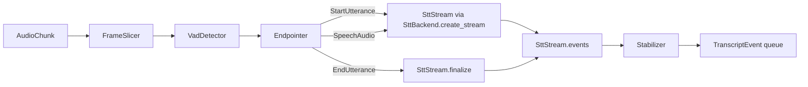
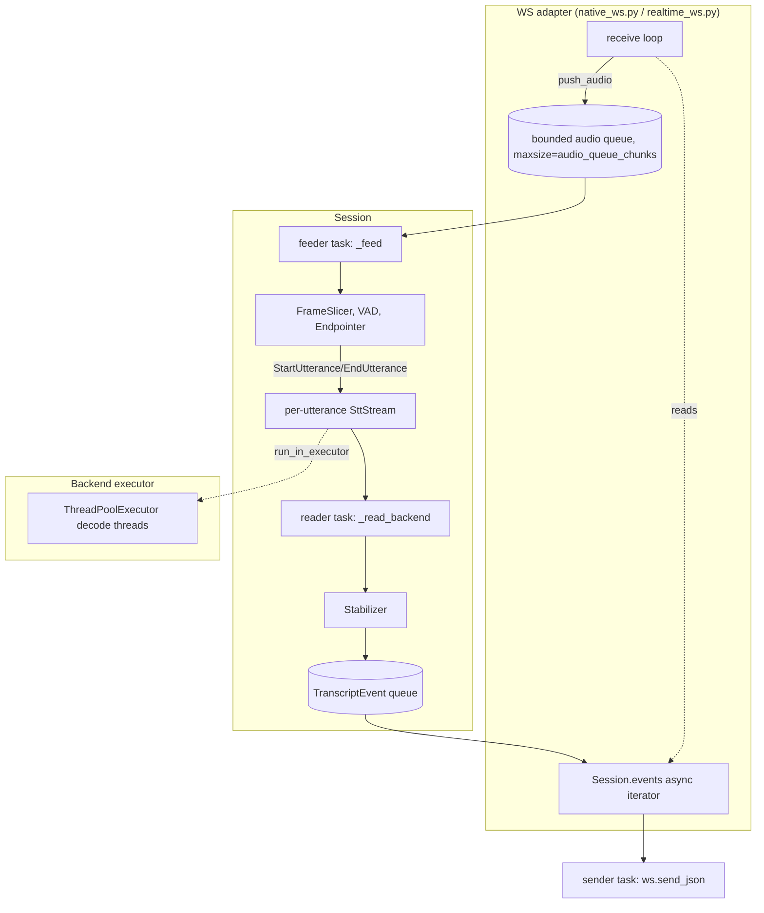

# Architecture

This document describes the components, data flow, execution model, and
layering rules of `stt-server`. Like `docs/backends.md` and
`docs/openai-compat.md`, every file, class, and command named below is
grep-verified against the actual source at the time of writing — this is the
as-built system, not an aspirational one.

## 1. Components

A single asyncio Python process serves all APIs. There is no built-in
scale-out; horizontal scale is via replicas behind a load balancer (stated,
not built — see `benchmarks/` for what one replica can sustain).

```
src/stt_server/
  api/       realtime_ws.py, transcriptions_http.py, native_ws.py, app.py, guards.py
  core/      session.py, audio.py, vad.py, endpointing.py, stabilizer.py, events.py
  backends/  base.py, registry.py, mock.py, sherpa/, funasr/, qwen3asr/
  metrics/   registry.py
  config/    settings.py
benchmarks/  accuracy/latency/load/stabilizer/endpointing runners (top-level, not under src/)
```

(See `docs/superpowers/specs/2026-07-02-stt-server-design.md` §2.2 for the
full repository layout as originally planned; the above is the subset this
document discusses.)

### 1.1 API layer — protocol adapters

Three entry points, all thin encode/decode layers with no ASR logic of their
own:

- `src/stt_server/api/realtime_ws.py` — OpenAI Realtime-style WebSocket
  (`/v1/realtime?intent=transcription`).
- `src/stt_server/api/transcriptions_http.py` — OpenAI file-style HTTP
  (`POST /v1/audio/transcriptions`).
- `src/stt_server/api/native_ws.py` — the native WebSocket protocol
  (`/ws/transcribe`), exposing the internal `TranscriptEvent` stream
  (including the stable/volatile split the OpenAI protocol can't express)
  directly as JSON. Benchmark clients (`benchmarks/client_ws.py`) talk to
  this protocol, so benchmark instrumentation never depends on OpenAI
  framing.

`src/stt_server/api/app.py` is the FastAPI application factory
(`create_app`): it wires backend startup/shutdown into the app lifespan,
mounts the three routers, and exposes `/healthz`, `/readyz`, and `/metrics`.
It also owns `UploadSizeGuardMiddleware`, a pure-ASGI middleware that rejects
a declared-oversized upload on `POST /v1/audio/transcriptions` using only the
`Content-Length` header, before Starlette's multipart parser ever buffers the
body (the post-read byte-count check in `transcriptions_http.py` is the
backstop for chunked-encoding requests, which have no `Content-Length`).

`src/stt_server/api/guards.py` holds cross-adapter auth and capacity guards:
`check_token` (constant-time bearer-token comparison via
`secrets.compare_digest`, comparing against every configured token
unconditionally so timing doesn't leak which one matched), `SessionSlots`
(a bounded concurrent-session counter), and `session_deadline` (an absolute
per-session duration cutoff, checked opportunistically on message arrival
rather than by a background timer).

### 1.2 Session core — protocol-agnostic

`src/stt_server/core/session.py`'s `Session` class is the pipeline: audio
chunks in, `TranscriptEvent`s out. It knows nothing about WebSockets, HTTP,
or OpenAI wire formats — see §4 below for the layering rule this encodes.

Supporting modules:

- `src/stt_server/core/events.py` — `AudioChunk` (PCM16 mono 16 kHz,
  carrying a `time.monotonic()` ingest timestamp) and `TranscriptEvent`
  (the unified event model: `EventType.{SPEECH_START,SPEECH_END,PARTIAL,
  STABILIZED,FINAL,ERROR}`).
- `src/stt_server/core/audio.py` — `FrameSlicer`, re-chunking arbitrarily
  sized PCM16 byte strings into fixed-duration frames.
- `src/stt_server/core/vad.py` — `VadDetector` interface; `EnergyVad` is the
  dependency-free reference/test implementation (Silero VAD is wired in via
  `make_vad` where the `silero` extra is installed).
- `src/stt_server/core/endpointing.py` — `Endpointer`, a pure, clock-free
  state machine (`EndpointerState.{IDLE,SPEECH,ENDPOINTING}`) driven only by
  VAD-classified frames, emitting `StartUtterance` / `SpeechAudio` /
  `EndUtterance` actions.
- `src/stt_server/core/stabilizer.py` — `Stabilizer`, maintaining a
  per-utterance committed prefix that only grows, splitting each partial
  into `{stable_text, volatile_text}`.

### 1.3 Backend plugins

`src/stt_server/backends/base.py` defines the contract (`SttBackend`,
`SttStream`, `BackendCapabilities`, `StreamConfig`, `BackendEvent`,
`BackendUnavailableError`); `src/stt_server/backends/registry.py` maps
config-declared backend names to instances. Four backends ship in this
repo — `mock`, `sherpa` (`sherpa_onnx`), `funasr`, `qwen3asr` — each with its
own execution strategy (§3). See `docs/backends.md` for the full plugin
contract, conformance suite, and per-backend setup; this document only
covers how they fit into the process's concurrency model.

### 1.4 Metrics

`src/stt_server/metrics/registry.py` defines its own `CollectorRegistry`
(`REGISTRY`) rather than using `prometheus_client`'s process-global default,
so `/metrics` output is limited to exactly this server's families and tests
stay hermetic. `/metrics` is deliberately unauthenticated — there is no
token check on that route in `create_app`. This is a documented,
intentional trade-off: Prometheus needs to scrape it without a bearer token,
so it must not be reachable by untrusted clients. `deploy/docker-compose.yaml`
enforces this by keeping Prometheus on an internal Docker network and never
publishing it as a host port; if you deploy `stt-server` behind a reverse
proxy or expose port 8000 more broadly, block `/metrics` at the proxy or keep
the whole service on a private network (see the README's Observability
section for the full note).

## 2. Data flow — the session pipeline

One `Session` per WebSocket connection; one ephemeral `Session` per
file-transcription request (file mode streams decoded audio through the same
pipeline faster than real time). Audio flows through a fixed sequence of
stages; a fresh backend `SttStream` is created per utterance (on
`StartUtterance`, closed after `FINAL`) — see `Session._apply` in
`session.py`.



Concretely, per `session.py`:

1. `push_audio()` hands an `AudioChunk` to the (bounded) audio queue — see
   §3 for why this is a queue and not an inline call.
2. `FrameSlicer.push()` re-chunks it into fixed `frame_ms` frames.
3. Each frame goes through `VadDetector.is_speech()`.
4. `Endpointer.process(frame, is_speech)` yields zero or more
   `EndpointAction`s (`StartUtterance` with its pre-roll frame buffer,
   `SpeechAudio`, or `EndUtterance` with a reason).
5. `Session._apply()` interprets each action: `StartUtterance` creates a
   backend `SttStream` via `create_stream()` and starts a reader task
   (`_read_backend`); `SpeechAudio` pushes the frame onto the open stream;
   `EndUtterance` calls `stream.finalize()`, awaits the reader's return
   value, and emits `FINAL`.
6. The reader task (`_read_backend`) consumes `stream.events()`
   (`BackendEvent`s tagged `partial`/`final`), feeding partials through
   `Stabilizer.update()` and emitting `PARTIAL`/`STABILIZED` events.
7. All emitted `TranscriptEvent`s land on `Session._queue`, drained by
   `Session.events()` — the one interface every protocol adapter's sender
   loop consumes.

## 3. Execution and concurrency model

### 3.1 Approach C — per-backend execution strategy

Quoting the design spec, §2.1:

> The server core is one asyncio event loop. The backend plugin interface is
> async; each backend declares and owns its concurrency model:
>
> - **mock** — pure asyncio, no threads.
> - **sherpa-onnx** — dedicated `ThreadPoolExecutor` (onnxruntime releases
>   the GIL during inference).
> - **FunASR** — bounded thread pool; optional micro-batching worker if
>   measurement shows benefit.
> - **Qwen3-ASR** — delegates to the official Qwen3-ASR inference
>   framework's vLLM async engine, which manages GPU batching itself.

The as-built backends follow this, with one correction the implementation
discovered: `qwen_asr`'s `Qwen3ASRModel.LLM` wraps vLLM's **synchronous**
offline `LLM` class, not `AsyncLLMEngine` — so, like the other two real
backends, every `generate()` call must run on a background thread rather
than being awaited in-loop directly (documented in
`src/stt_server/backends/qwen3asr/backend.py`'s module docstring). What
Qwen3-ASR does keep that's distinctive is the framework's *native streaming
state machine* — `init_streaming_state` / `streaming_transcribe` /
`finish_streaming_transcribe` — run inside the executor rather than a
hand-rolled redecode loop. Concretely:

| Backend | Execution primitive | Where |
|---|---|---|
| mock | none — pure `asyncio` | `src/stt_server/backends/mock.py` |
| sherpa-onnx | dedicated `ThreadPoolExecutor` | `src/stt_server/backends/sherpa/backend.py` (`SherpaStream`, `SherpaBackend`) |
| FunASR | bounded `ThreadPoolExecutor` | `src/stt_server/backends/funasr/backend.py` (`FunasrStream`, `FunasrBackend`) |
| Qwen3-ASR | bounded `ThreadPoolExecutor` around vLLM's sync `LLM`, using the framework's native streaming state | `src/stt_server/backends/qwen3asr/backend.py` (`Qwen3AsrStream`, `Qwen3AsrBackend`) |

Every real backend uses `run_in_executor` internally to keep the event loop
from blocking on model inference; the mock backend exists precisely so CI
and the default test suite need no threads or model weights at all.

### 3.2 Concurrency model, including the bounded audio queue

`Session` does not run the pipeline (§2) inline inside `push_audio()`.
Instead, `push_audio()` enqueues each `AudioChunk` onto a bounded
`asyncio.Queue` (`_audio_queue`, sized by `audio_queue_chunks`), and a single
per-session **feeder task** (`_feed()`, started lazily by `_ensure_feeder()`)
is the sole consumer that actually runs frames through the VAD/endpointer
pipeline and drives the backend stream. This decouples the caller of
`push_audio()` (the WebSocket receive loop) from however slow the pipeline
or backend currently is — the receive loop enqueues and returns immediately,
never blocking on inference.

When the queue is full, `Session` sheds under a configured policy
(`audio_overflow_policy`, spec §13):

- `drop_oldest` — evict the oldest queued chunk to make room for the new one
  (increments the `stt_audio_dropped_total`-style counter `AUDIO_DROPPED`
  and rate-limits a warning log to at most once per second per session).
- `error` — emit a terminal `ERROR` event (`error_code="backpressure"`) and
  end the session.



So, end to end: **WS receive loop → bounded audio queue (`drop_oldest` /
`error` policy) → feeder task → pipeline (FrameSlicer/VAD/Endpointer) →
per-utterance backend `SttStream` → executor decode thread(s) → reader
task → Stabilizer → `TranscriptEvent` queue → sender task → wire**.

Two asyncio tasks run per active session on top of the feeder: a **reader
task** (`_read_backend`, one per utterance, consuming `stream.events()`) and
the adapter's own **sender task** (e.g. `native_ws.py`'s `sender()`, draining
`Session.events()` to the WebSocket). `Session.abort()` cancels the feeder
and reader tasks and closes any open backend stream, so a disconnect or
fatal error can never leave a task or a model-side stream running after the
session ends.

## 4. Layering rule

Quoting the design spec, §2:

> **Load-bearing rule:** the session core speaks only internal types. It
> never imports from the API layer. Protocol adapters convert wire formats
> to/from the internal model at the boundary.

Enforcement today is manual grep, run at doc/review time (there is no CI
import-linter job for this yet):

```
grep -rn "from stt_server.api" src/stt_server/core/*.py
```

returns nothing — verified while writing this document. The dependency
arrow only ever points one way: `api/` imports from `core/` and
`backends/`, never the reverse; `core/` imports only `backends/base.py`
(for the `SttBackend`/`SttStream`/`StreamConfig` types `session.py` depends
on), `config/` (for typed settings, e.g. `VadConfig`/`EndpointingConfig`/
`StabilizerConfig`), and `metrics/registry.py` (for the Prometheus counters
`session.py` increments directly) — never a concrete
`backends/{sherpa,funasr,qwen3asr}` module or anything under `api/`.
`benchmarks/` is a *separate top-level package*, not under `src/`,
specifically so nothing in `src/stt_server` can ever come to depend on it
(see `benchmarks/__init__.py`'s docstring).

Where the adapters actually do the encoding: each protocol adapter owns a
pure function from `TranscriptEvent` to wire JSON — `encode_native()` in
`src/stt_server/api/native_ws.py` is the simplest example (a `dict` for the
native protocol's JSON frames); `realtime_ws.py` and
`transcriptions_http.py` have the equivalent OpenAI-shaped encoders,
documented and compatibility-tested in `docs/openai-compat.md`. None of
these encoders live in `core/` — that is the layering rule in practice.

## 5. Further reading

| Doc | Covers |
|---|---|
| [`docs/backends.md`](backends.md) | Backend plugin contract, conformance suite, how to write a new backend, per-backend setup/verification |
| [`docs/openai-compat.md`](openai-compat.md) | Tested OpenAI Realtime / file-transcription compatibility matrix |
| [`benchmarks/README.md`](../benchmarks/README.md) | Benchmark suite: accuracy, latency, load, stabilizer study, endpointing — one-command invocations |
| [`benchmarks/cuda_runbook.md`](../benchmarks/cuda_runbook.md) | One-command GPU benchmark procedure for a CUDA box |
